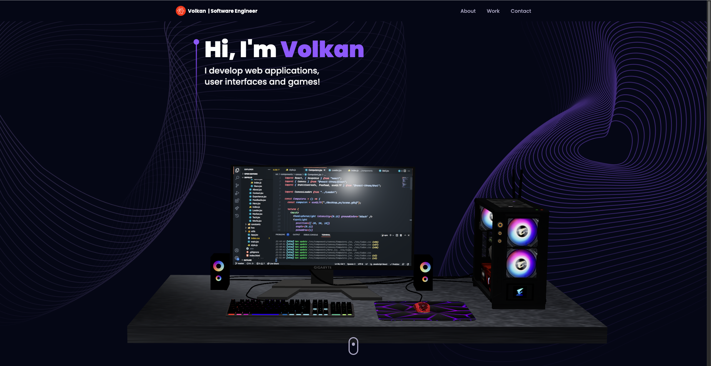

# 3D Portfolio

A modern and interactive portfolio website built with React, Three.js, and TailwindCSS. This project showcases professional experience, technical skills, and projects in an engaging 3D environment.




## Features

- Interactive 3D elements powered by Three.js
- Responsive design that works on all devices
- Smooth animations using Framer Motion
- Modern UI with TailwindCSS
- Contact form functionality with EmailJS
- Dynamic project showcase
- Professional experience timeline
- Tech stack visualization
- Testimonials section

## Tech Stack

- React
- Three.js
- TailwindCSS
- Framer Motion
- EmailJS
- Vite
- React Three Fiber
- React Three Drei

## Getting Started

### Prerequisites

- Node.js (v18 or higher recommended)
- npm or yarn

### Installation

1. Clone the repository
    ```bash
    git clone https://github.com/volkanb/3d-portfolio.git
    ```

2. Install dependencies
    ```bash
    cd 3d-portfolio
    npm install
    ```

3. Start the development server
    ```bash
    npm run dev
    ```
The application will be available at `http://localhost:5173`

### Building for Production

To create a production build:

```bash
npm run build
```

## Project Structure

- `/src/assets` - Images, icons, and other static assets
- `/src/components` - React components including 3D elements
- `/src/constants` - Configuration and constant data
- `/src/styles` - Global styles and TailwindCSS configurations
- `/src/utils` - Utility functions and helpers
- `/public` - Public assets including 3D models

## Features in Detail

### 3D Elements
- Interactive computer model
- Floating 3D icons
- Animated star background
- Earth globe visualization

### Sections
- Hero section with 3D computer model
- About section with service cards
- Experience timeline
- Tech stack showcase
- Project portfolio
- Testimonials
- Contact form

## Customization

The project can be customized by modifying the following files:


